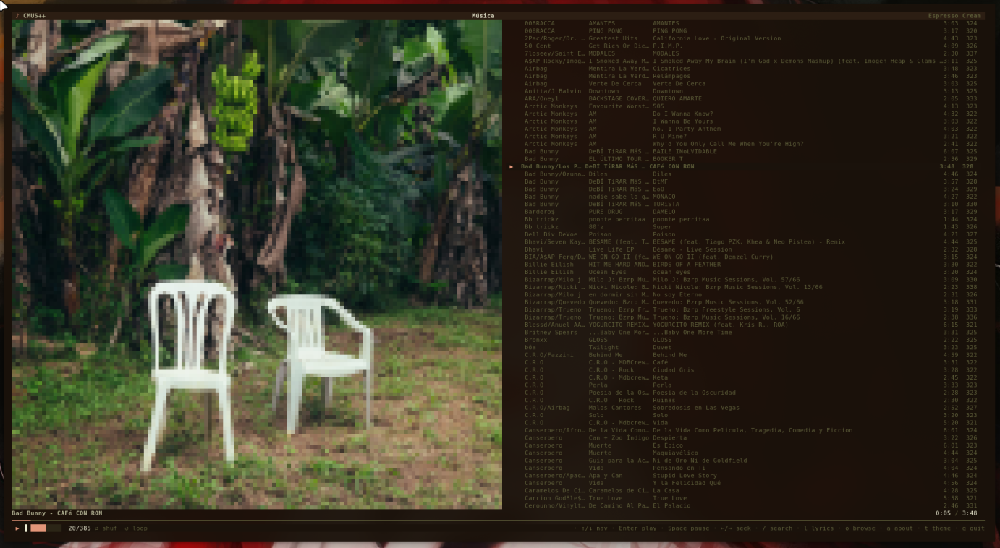
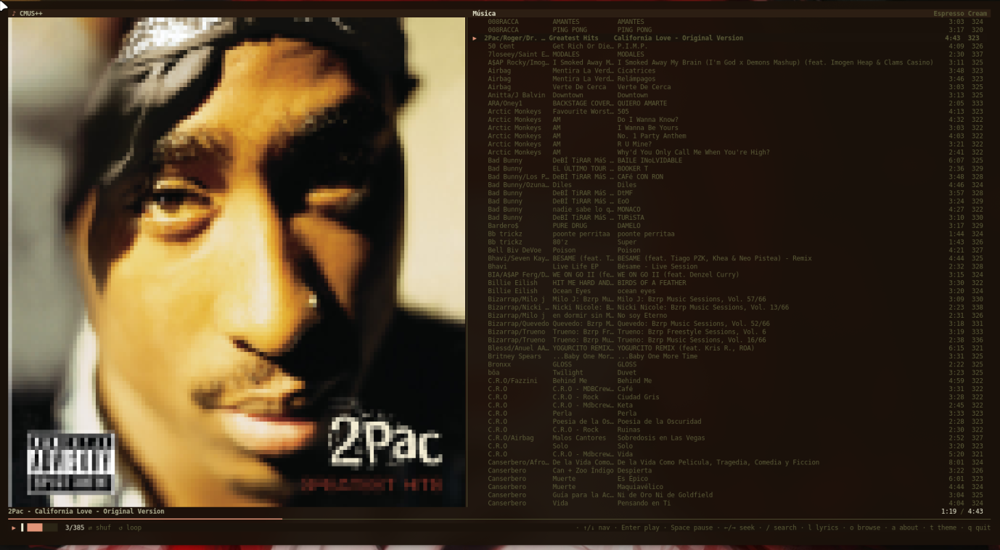
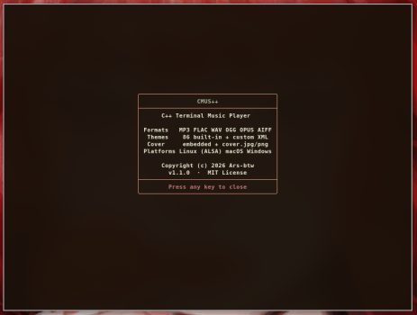

```markdown
# CMUS++

```text
 ██████╗███╗   ███╗██╗   ██╗███████╗    ██╗  ██╗
██╔════╝████╗ ████║██║   ██║██╔════╝    ╚██╗██╔╝
██║     ██╔████╔██║██║   ██║███████╗     ╚███╔╝
██║     ██║╚██╔╝██║██║   ██║╚════██║     ██╔██╗
╚██████╗██║ ╚═╝ ██║╚██████╔╝███████║ ██╗██╔╝ ██╗
 ╚═════╝╚═╝     ╚═╝ ╚═════╝ ╚══════╝ ╚═╝╚═╝  ╚═╝
                    ++ C++ Terminal Music Player
```

> [ Español](README.md) | [ English](README-EN.md) | [ Deutsch](README-DE.md) | [ Português](README-PT-BR.md) | Français | [ Italiano](README-IT.md) | [ Русский](README-RU.md)

**CMUS++** est un lecteur de musique pour terminal écrit en C++17. Ultra-léger, extrêmement rapide, piloté au clavier et sans dépendances graphiques.

**Fonctionnalités :**
*   **Formats :** MP3, FLAC, WAV, OGG, OPUS, AIFF.
*   **Pochettes :** Extraction des pochettes intégrées MP3, FLAC, OGG/OPUS + repli sur cover.jpg/png.
*   **Paroles :** `.lrc` synchronisées + paroles intégrées dans les tags (USLT/LYRICS), 100 % hors ligne.
*   **Multiplateforme :** Linux (ALSA), macOS (CoreAudio), Windows (WinMM).
*   **Personnalisable :** 86 thèmes intégrés + prise en charge des thèmes XML personnalisés.
*   **Rapide :** Aucun temps de chargement, décodage efficace et rendu sans scintillement.
*   **Fenêtre À propos :** Appuyez sur `a` pour afficher les infos du projet, la licence et les crédits.

---

## Aperçus





---

## Téléchargement (Release)

Envie de simplement essayer ? Téléchargez le binaire précompilé depuis la [**version v1.1.0**](https://github.com/Ars-byte/cmuspp/releases/tag/v1.1.0) (Linux x86_64) :

```bash
wget https://github.com/Ars-byte/cmuspp/releases/download/v1.1.0/cmuspp-linux-x86_64
chmod +x cmuspp-linux-x86_64
./cmuspp-linux-x86_64
```

> Nécessite le dossier `themes/` (celui du dépôt) à côté de l'exécutable.

---

## Installation XBPS (Void Linux)

Sous Void Linux, vous pouvez installer CMUS++ depuis le paquet `.xbps` précompilé :

```bash
sudo xbps-install -S --repository=https://github.com/Ars-byte/cmuspp/releases/download/v1.1.1 cmuspp-void
```

Le paquet installe le binaire dans `/usr/bin/cmuspp` ainsi que les 86 thèmes intégrés et les thèmes XML supplémentaires dans `/usr/share/cmuspp/themes/`.

---

## Installation et Compilation

### 1. Installer les dépendances

Vous avez besoin d'un compilateur C++ et des bibliothèques `libsndfile`, `libjpeg` et `libpng` (ainsi qu'ALSA sous Linux).

*   **Ubuntu / Debian :** `sudo apt install g++ libsndfile1-dev libasound2-dev libjpeg-dev libpng-dev`
*   **Arch Linux :** `sudo pacman -S gcc libsndfile alsa-lib libjpeg-turbo libpng`
*   **macOS :** `brew install libsndfile jpeg libpng` (requiert Homebrew)

### 2. Compiler

Clonez le dépôt et utilisez le script d'auto-compilation inclus :

```bash
# Accorder les permissions d'exécution
chmod +x bootstrap.sh

# Compiler
./bootstrap.sh

# Exécuter !
./cmuspp
```

---

## Pour NixOS

Ce dépôt est un flake Nix. Pour l'essayer sans l'installer :

```
nix run github:Ars-byte/cmuspp
```

Pour l'installer sur le système, ajoutez le flake comme input :

```
{
  inputs = {
    nixpkgs.url = "github:NixOS/nixpkgs/nixos-unstable";
    cmuspp.url = "github:Ars-byte/cmuspp";
  };
}
```

```
{ inputs, pkgs, ... }:
{
  environment.systemPackages = [ inputs.cmuspp.packages.${pkgs.system}.cmuspp ];
}
```

Ou installez-le de manière impérative :

```
nix profile install github:Ars-byte/cmuspp
```

Vous pouvez aussi l'installer depuis le flake de mikuri (contributeur du projet) :

```
nix profile add github:mikuri12/my-lazy-nixos-pkgs#cmuspp
```


---

## Pochettes d'album

CMUS++ extrait et affiche automatiquement les pochettes d'album :

*   **MP3 :** Frame APIC (ID3v2.2/2.3/2.4)
*   **FLAC :** METADATA_BLOCK_PICTURE
*   **OGG / OPUS :** METADATA_BLOCK_PICTURE dans les commentaires Vorbis
*   **Repli :** `cover.jpg`, `cover.png`, `folder.jpg`, etc. dans le même répertoire

**Terminaux compatibles :**
*   **Kitty / WezTerm / ghostty / iTerm2 :** Affichage d'image natif (protocole Kitty)
*   **Autres terminaux (Alacritty, GNOME, etc.) :** Rendu ANSI en demi-bloc (▄) avec true-color

---

## Paroles

Appuyez sur `l` dans le lecteur pour afficher les paroles de la chanson en plein écran (masque la liste). 100 % hors ligne — aucun réseau, aucun service externe. Les paroles sont résolues ainsi :

1. **`.lrc` synchronisé** à côté de la chanson (ex. : `chanson.mp3` → `chanson.lrc`). La ligne courante est mise en évidence et avance en synchronisation avec la lecture.
2. **Paroles intégrées dans les tags** du fichier lui-même (frame `USLT` en MP3, champ `LYRICS` en FLAC/OGG). Affichées en texte statique, défilables avec `↑`/`↓`.

Format `.lrc` :

```
[ti:Titre]
[ar:Artiste]
[00:12.50]Première ligne
[00:24.00]Deuxième ligne
```

Prend en charge les timestamps `[mm:ss]` / `[mm:ss.xx]`, plusieurs timestamps par ligne (`[00:12][00:24]texte`) et le tag `[offset:±ms]`.

---

## Commandes

CMUS++ est conçu pour être utilisé entièrement sans souris.

| Touche | Action |
| :--- | :--- |
| `↑` / `↓` (ou `k`/`j`) | Naviguer dans la liste |
| `Enter` | Lire / Entrer dans le dossier |
| `Espace` | Pause / Reprendre |
| `←` / `→` (ou `h`) | Reculer 5s / Avancer 5s (Dans le navigateur : remonter d'un niveau) |
| `n` / `p` | Piste suivante / Précédente |
| `+` / `-` | Volume + / - |
| `s` | Activer/Désactiver Shuffle (Aléatoire) |
| `r` | Activer/Désactiver Repeat (Boucle) |
| `l` | Afficher/masquer les paroles (.lrc ou intégrées) en plein écran |
| `/` | Rechercher une piste dans le dossier actuel (tapez pour filtrer, `Enter` lit) |
| `t` | Changer le thème de couleurs |
| `o` | Ouvrir l'explorateur de fichiers |
| `a` | Afficher les informations (À propos) |
| `q` | Quitter |

---

## Thèmes Personnalisés

Appuyez sur `t` dans l'application pour changer de thème. Vous pouvez créer vos propres thèmes en créant des fichiers `.xml` dans le dossier `themes/` (à côté de l'exécutable) ou dans `~/.config/cmuspp/themes/`.

**Exemple de structure (`themes/mon-theme.xml`):**
```xml
<?xml version="1.0" encoding="UTF-8"?>
<theme name="Mon Thème Personnalisé">
  <!-- Couleurs de texte (Clair -> Sombre) -->
  <fg0 r="248" g="248" b="242"/> <fg1 r="215" g="210" b="195"/>
  <fg2 r="117" g="113" b="94"/>  <fg3 r="75"  g="71"  b="60"/>
  
  <!-- Accents -->
  <acc  r="166" g="226" b="46"/> <warn r="230" g="219" b="116"/>
  
  <!-- Fonds (bgr/bgg/bgb = fond | fgr/fgg/fgb = texte) -->
  <bghdr  bgr="39" bgg="40" bgb="34" fgr="102" fgg="217" fgb="239"/>
  <bgsel  bgr="73" bgg="72" bgb="62" fgr="248" fgg="248" fgb="242"/>
  <bgplay bgr="30" bgg="44" bgb="18" fgr="166" fgg="226" fgb="46"/>
  <bgstat bgr="29" bgg="29" bgb="24" fgr="117" fgg="113" fgb="94"/>
</theme>
```
*Les nouveaux thèmes seront détectés automatiquement au redémarrage de l'application.*

---
**Licence MIT** — N'hésitez pas à modifier et à utiliser le code.
